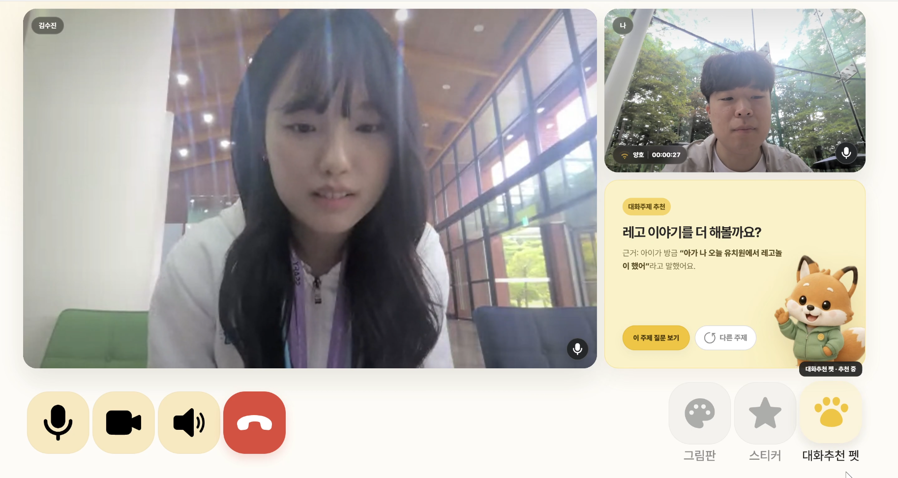
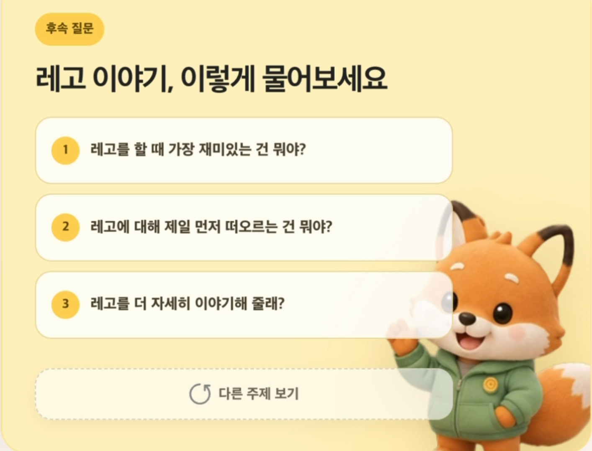
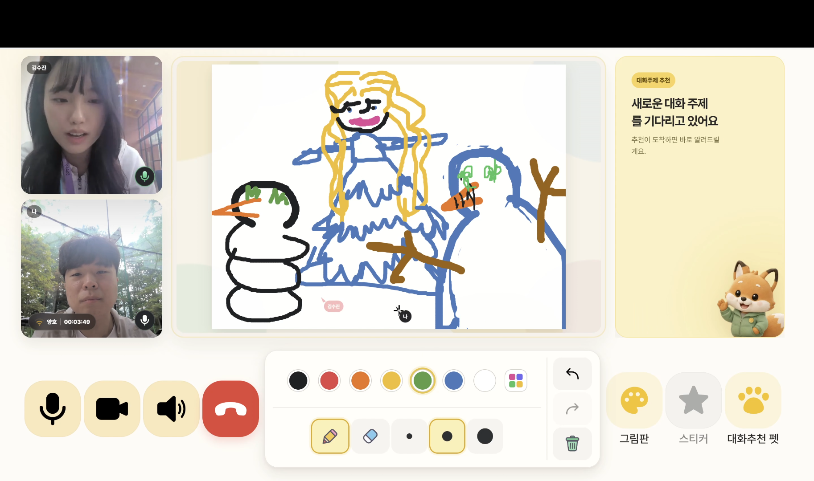
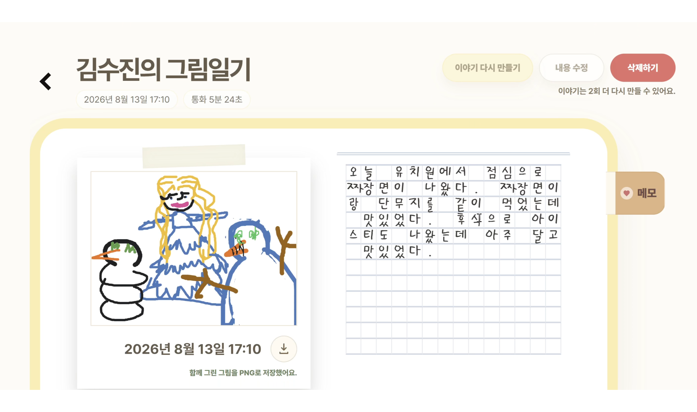
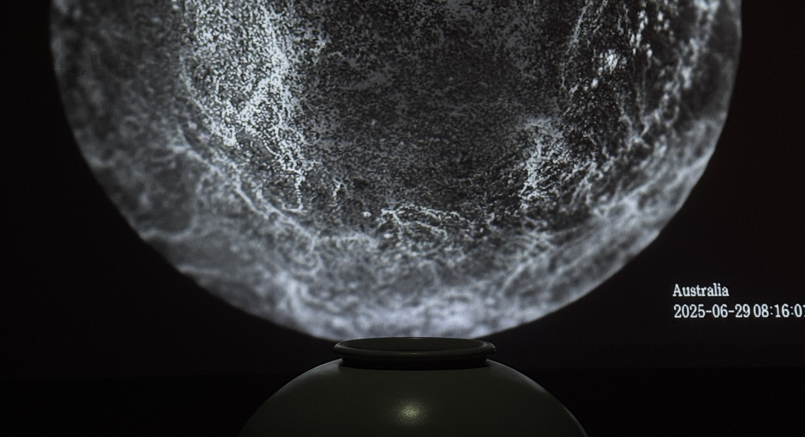
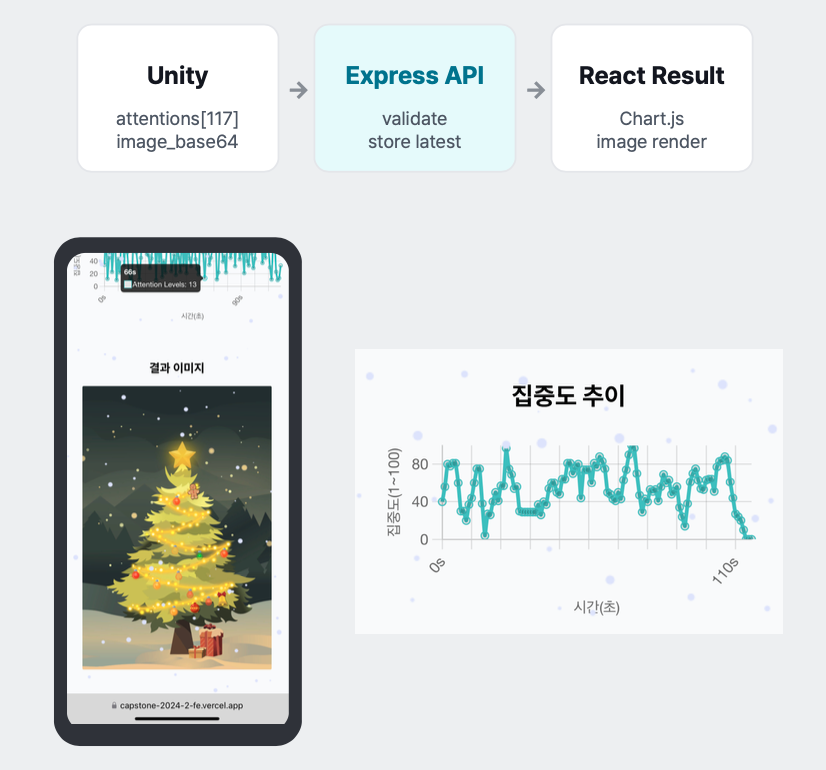
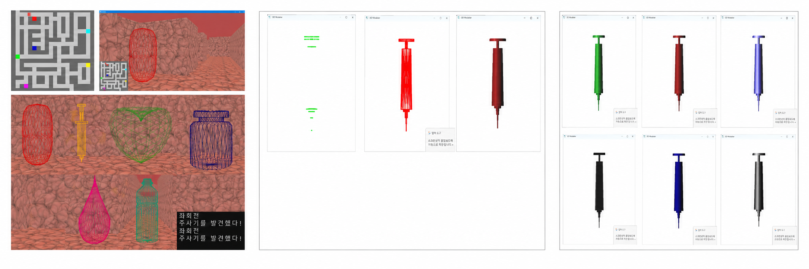

# 🎮 상호작용하는 개발자

사람과 서비스, 그리고 기술이 만나는 지점을 설계하고 구현합니다.
사용자의 피드백을 듣고, 동료와 관점을 공유하며 더 나은 해결책을 함께 고민합니다.
기술적 근거와 데이터를 바탕으로 사람과 기술이 자연스럽게 연결되는 안정적인 서비스를 만드는 것을 지향합니다.

## Education
- 중앙대학교 Art&Technology · 소프트웨어벤처융합전공
- GPA **3.98 / 4.5**
- SSAFY 15기 · 2026.01.07 ~ 현재
- 관심 분야: **Backend · AI/Data Pipeline · Game Server · Game Client**
- Blog: [hyunjeekang.github.io](https://hyunjeekang.github.io)

## Tech Stack

### Languages

    

### Backend & Database

      

### AI & Data

   

### Game & Interactive

    

### Tools

     

## Projects

### 1. CallMeBaby

<table width="100%">
  <tr>
    <td width="25%" align="center"> 실시간 영상통화</td>
    <td width="25%" align="center"> AI 대화 주제 추천</td>
    <td width="25%" align="center"> 부모·아이 공동 그림판</td>
    <td width="25%" align="center"> 통화 후 AI 일기</td>
  </tr>
</table>

| 항목 | 내용 |
| --- | --- |
| 소개 | 아동과 부모의 영상통화에서 아이의 발화를 STT로 변환하고, 대화 토픽·관심사 후보·근거 기반 그림일기를 생성하는 AI 서비스 |
| 기간 · 규모 | 2026.07.06 ~ 2026.08.10 · 6명 |
| 역할 | [ 팀장/AI ] 전체 일정·파트 간 협업 관리, 모델 학습·평가, AI-Backend-Frontend 연동 및 QA 담당 |
| 기술 | Python, Whisper-small, LoRA, Redis, GPT-4.1, Backend API |

#### 기여도 및 구현 내용

- 아동 음성 데이터 EDA·분할과 Whisper-small LoRA 파인튜닝
- 관심사 후보를 자동 확정하지 않고 부모 확인 전 `PENDING` 상태로 전달하는 파이프라인 설계
- STT 결과를 토픽·관심사·그림일기로 연결하고 AI-Backend-Frontend 간 데이터 계약 조율
- 팀장으로서 데일리 스크럼, 파트별 협업 기준, 실제 통화 기반 QA를 운영

#### 트러블슈팅

오프라인 CER이 개선되어도 실제 통화에서는 고유명사 붕괴, 배경 소음에 따른 VAD 분절, 서버 결과가 UI에 표시되지 않는 경로 문제가 남았습니다. 모델 지표만으로 완료를 판단하지 않고 실제 마이크 E2E 회귀 테스트를 별도 기준으로 두었습니다. 또한 통화방 단위 Redis CAS와 `eventId` 멱등성을 적용해 동일 통화방 STT 동시 저장 100건을 유실 없이 처리했습니다.

### 2. Resonance

<table width="100%">
  <tr>
    <td width="58%" align="center"></td>
    <td width="42%" valign="middle"><b>전시 화면</b>  수집한 글로벌 뉴스의 감정 데이터를 TouchDesigner 시각화와 사운드 아트로 표현했습니다. 관람객이 데이터 파이프라인의 결과를 실시간으로 경험할 수 있도록 구성했습니다.</td>
  </tr>
</table>

| 항목 | 내용 |
| --- | --- |
| 소개 | 실시간 글로벌 뉴스를 수집·번역·감정 분석한 뒤 TouchDesigner 시각화와 사운드 아트에 연동한 미디어아트 프로젝트 |
| 기간 · 규모 | 2025.02 ~ 2025.07 · 4명 |
| 역할 | [ 개발 ] 뉴스 수집·번역·AI감정 분석·저장·OSC 연동·전시 운영 자동화 개발 |
| 기술 | Python, Transformers, SQLite, OSC, TouchDesigner |

#### 기여도 및 구현 내용

- 뉴스 수집 → 번역 → 감정 분석 → SQLite 저장 → OSC 전송 파이프라인 구축
- RoBERTa와 BART-MNLI 결과를 결합해 감정 분석 분포 개선
- 주기적 데이터 수집·전송과 `subprocess` 기반 독립 실행 구조 구현
- TouchDesigner에 실시간 감정 데이터를 전달하고 전시 운영 자동화

#### 트러블슈팅

단일 감정 모델 사용 시 뉴스 헤드라인의 대부분이 중립으로 분류되어 시각적 표현이 제한되었습니다. 두 모델의 결과를 결합하고 중립 확률에 휴리스틱 페널티를 적용해 중립 편향을 80% 이상에서 15% 미만으로 낮췄습니다. 전시 1주 전 외부 뉴스 API 장애가 발생했을 때는 대체 데이터 소스로 전환해 3일간 매일 10~19시 무중단 운영을 이어갔습니다.

### 3. Focus On/Off

<table width="100%">
  <tr>
    <td width="58%" align="center"></td>
    <td width="42%" valign="middle"><b>게임 결과 화면</b>  게임 중 수집한 EEG 집중도 데이터를 그래프로 보여주고, 플레이 결과 이미지와 함께 사용자가 자신의 집중 흐름을 돌아볼 수 있도록 구성했습니다.</td>
  </tr>
</table>

| 항목 | 내용 |
| --- | --- |
| 소개 | NeuroSky MindWave의 EEG 데이터를 게임 조작과 결과 화면에 연결한 뉴로피드백 게임. 사용자의 집중도 변화를 게임 플레이와 웹 시각화로 확인할 수 있다. |
| 기간 · 규모 | 2024.09 ~ 2024.12 · 4명 |
| 역할 | [ 팀장/Web ] Web·Frontend·Backend 개발, Unity-웹 연동 |
| 기술 | Unity, NeuroSky MindWave, Node.js, Express.js, React, Chart.js |

#### 기여도 및 구현 내용

- Unity WebRequest와 Node.js/Express REST API 사이의 JSON 통신 규격 설계
- EEG 집중도 배열과 게임 결과 이미지를 React 결과 화면에 연결
- 집중도 변화 그래프와 결과 이미지 페이지 구현
- 팀 일정·역할 조율 및 프로젝트 발표·시연 진행

#### 트러블슈팅

게임 결과 이미지를 Base64로 전송할 때 Express의 기본 Request Body 제한을 초과해 요청이 실패했습니다. 전시 환경이 1인 플레이 후 결과를 전송하는 구조라는 점을 고려해 이미지 저장소를 추가하는 대신 서버의 JSON 수신 제한을 조정하고 데이터 검증을 보강했습니다. 이후 50명 사용자 테스트를 장애 없이 완료했습니다.

### 4. OpenGL SOR 모델러 및 3D 미로 게임

<table width="100%">
  <tr>
    <td width="70%" align="center"></td>
    <td width="30%" valign="middle"><b>모델러와 미로 게임</b>  SOR 모델러로 생성한 의료 도구를 3D 미로에 배치하고, 점·선·면 표현과 재질·명도 변화를 확인할 수 있도록 구성했습니다.</td>
  </tr>
</table>

| 항목 | 내용 |
| --- | --- |
| 소개 | 2D 입력 좌표를 회전시켜 3D 모델을 생성하는 SOR 모델러와, 생성한 의료 도구를 활용한 1인칭 미로 게임입니다. 소아암 환우의 수술 불안을 낮추는 게이미피케이션 시뮬레이터를 목표로 기획했습니다. |
| 기간 · 규모 | 2024.09 ~ 2024.12 · 3명 |
| 역할 | [ 팀장/개발 ] SOR 모델러 전담 개발, 3D 미로 게임 이동·충돌 처리 공동 구현 |
| 기술 | C++, OpenGL, GLUT |

#### 기여도 및 구현 내용

- SOR 회전 알고리즘, 삼각형 면 생성, 외적 기반 법선 벡터 계산 구현
- 조명·재질·Flat/Smooth Shading과 점·선·면 보기 모드 구현
- 생성한 모델을 DAT 파일로 저장하고 미로에서 의료 도구 오브젝트로 재사용
- `gluLookAt` 기반 1인칭 이동, 20×20 격자 기반 벽 충돌·탈출 판정, 미니맵 구현
- 모델러 기능은 전담하고 게임 이동·충돌은 공동 구현

#### 트러블슈팅

초기에는 `Modeler` 클래스에 입력 처리, 모델 생성, 파일 저장, 렌더링 책임이 집중되어 기능을 수정할 때 영향 범위가 커졌습니다. 이후 모델 데이터, SOR 생성, 파일 입출력, 렌더링을 역할별 클래스로 분리하는 리팩터링을 진행해 변경 지점을 좁혔습니다. 게임에서는 렌더링과 충돌 판정에 동일한 격자 데이터를 사용해 화면에 보이는 벽과 실제 이동 제한이 어긋나지 않도록 했습니다.

## Contact

- Email: [its.hyunjee@gmail.com](mailto:its.hyunjee@gmail.com)
- Blog: [hyunjeekang.github.io](https://hyunjeekang.github.io)
- GitHub: [github.com/hyunnni](https://github.com/hyunnni)
